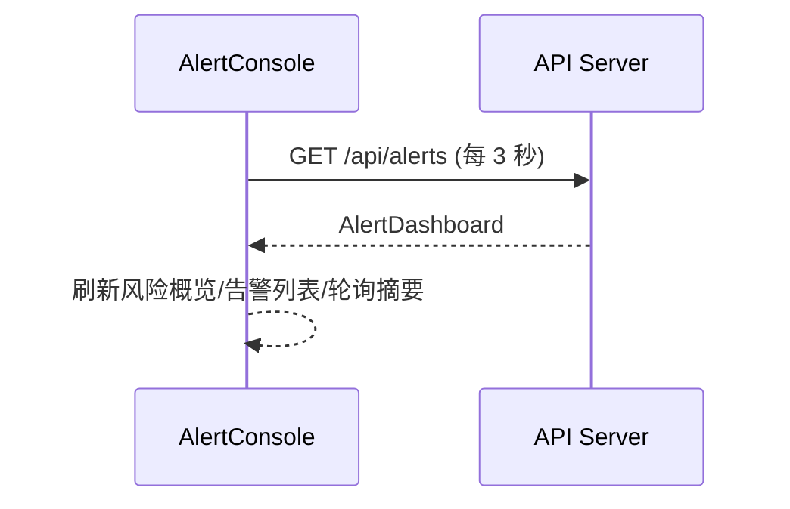
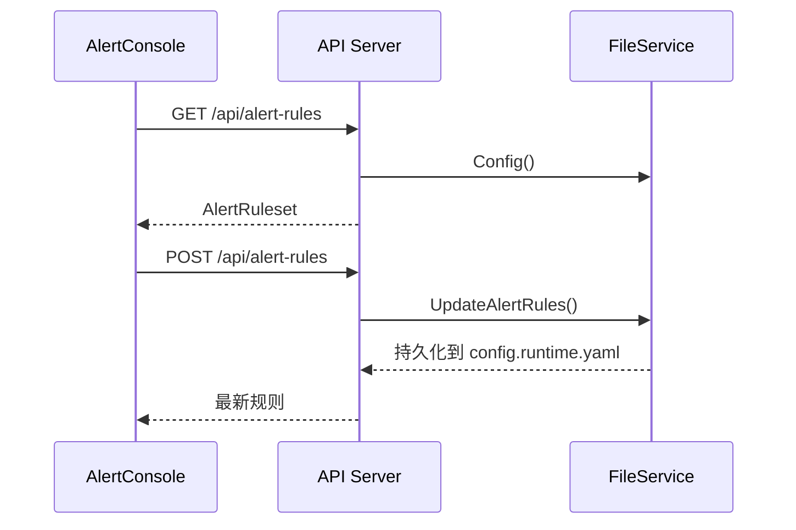

# 告警控制台（专题）

> 本文聚焦控制台的交互与页面结构，便于新人快速理解和排查。

## 1. 页面结构总览（线框示意）

```
[告警控制台]
┌──────────────────────────────────────────────────────────────┐
│ 顶部摘要：风险等级 / 窗口 / 刷新时间                           │
├──────────────────────────────────────────────────────────────┤
│ Tab：规则 | 告警 | 配置                                       │
├──────────────────────────────────────────────────────────────┤
│ 告警 Tab：                                                    │
│  ├ 概览卡（风险、级别统计）                                    │
│  ├ 统计卡（发送 vs 抑制）                                      │
│  ├ 告警列表（分页）                                           │
│  ├ 告警运行态（开关/抑制/间隔/日志路径）                        │
│  └ 轮询摘要（最后轮询/下一轮询/日志文件）                       │
│ 配置 Tab：                                                    │
│  ├ 开关：告警开关/抑制/从末尾开始                               │
│  └ 输入：日志路径/轮询间隔 + 保存按钮                           │
│ 规则 Tab：                                                    │
│  ├ 规则概览/默认策略/异常升级                                  │
│  └ 规则分组（致命/系统/业务/忽略，组内规则可折叠编辑）           │
└──────────────────────────────────────────────────────────────┘
```

## 2. 三个 Tab 的职责

### 2.1 告警 Tab
- **概览**：风险等级、级别统计、窗口与最新告警。
- **统计**：发送/抑制比例、决策总量。
- **告警列表**：最近决策，支持分页。
- **告警运行态**：当前开关、抑制、轮询间隔、从末尾开始、日志路径。
- **轮询摘要**：最近轮询/下一轮询/日志文件列表。

### 2.2 配置 Tab
- **开关区**：告警开关、抑制开关、从末尾开始。
- **配置区**：日志路径、轮询间隔。
- **保存**：点击“保存配置”后写入 `config.runtime.yaml` 并立即生效。

### 2.3 规则 Tab
- **规则概览**：各级别数量、发送/仅记录数量。
- **默认策略**：默认抑制窗口、默认大小写。
- **异常升级**：system 级别激增时升级为更高等级。
- **规则分组**：按级别分组（致命/系统/业务/忽略）。
- **折叠/展开**：规则默认折叠，点击展开编辑。
- **分组新增**：在分组内新增对应级别规则。
- **保存/刷新**：保存写入 `config.runtime.yaml`；刷新会覆盖未保存修改。

> 分组仅用于展示，匹配顺序仍按**全局编号**执行。

## 3. 关键交互流程（示意）

### 3.1 告警概览轮询


### 3.2 规则加载与保存


## 4. 数据来源与持久化
- **规则来源**：`/api/alert-rules`，保存后写入 `config.runtime.yaml` 的 `alert_rules`。
- **告警配置**：`/api/alert-config`，保存后写入 `config.runtime.yaml`。
- **告警概览**：`/api/alerts`，每 3 秒刷新。

## 5. 操作小贴士
- 删除规则后如果不点“保存规则”，刷新会恢复为上次保存版本。
- 新增规则后建议先展开填写关键词，避免“缺少关键词”保存失败。
- 想暂时不触发历史日志：保持 `alert_start_from_end=true`。

## 6. 常见问题
- **为什么分组里没有规则？**
  - 说明该级别暂时为空，可直接点分组内“新增规则”。
- **为什么刷新后规则回来了？**
  - 未点击“保存规则”，当前改动还在前端内存。

---

如需配置字段与规则结构说明，请参考：
- `docs/03-告警与AI/告警模式说明.md`
- `docs/99-架构附录/状态类型可视化.md`

