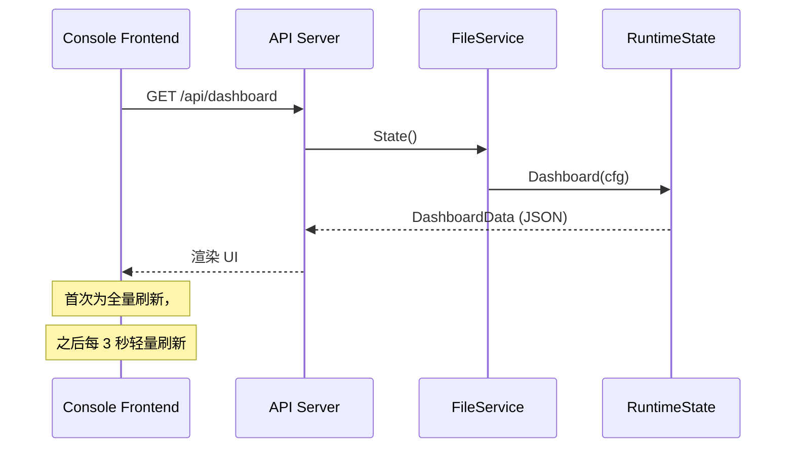
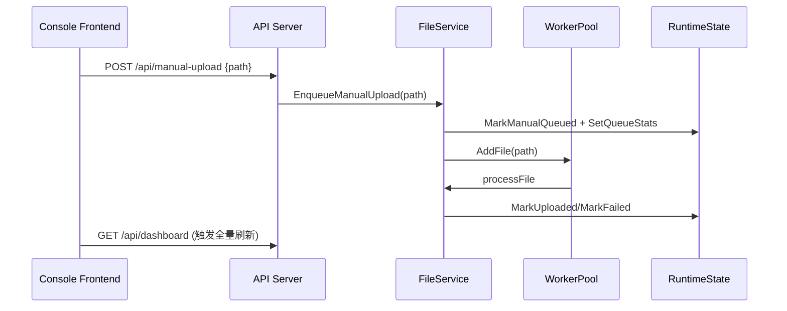
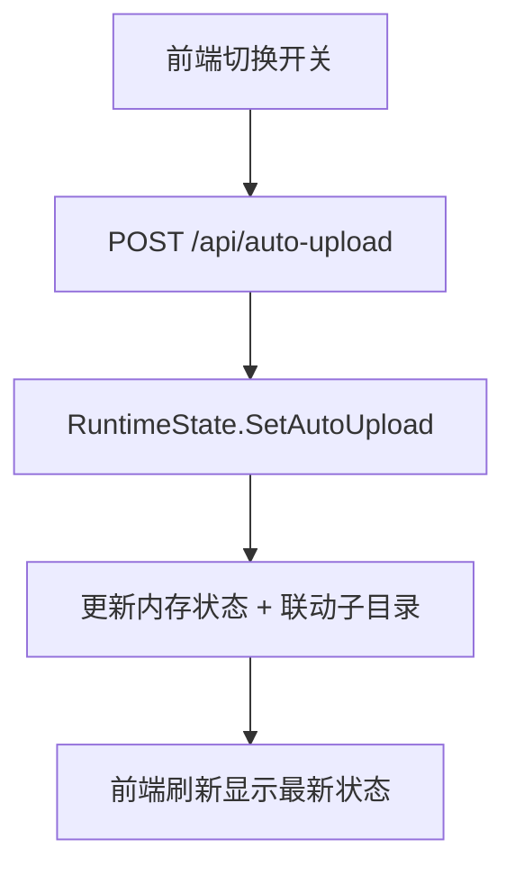
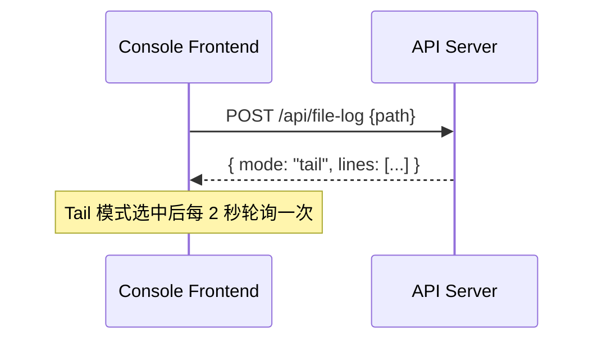
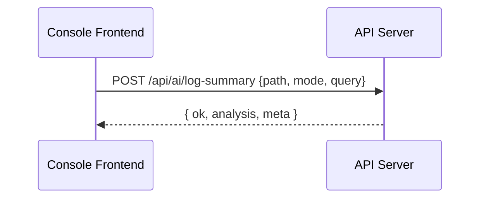
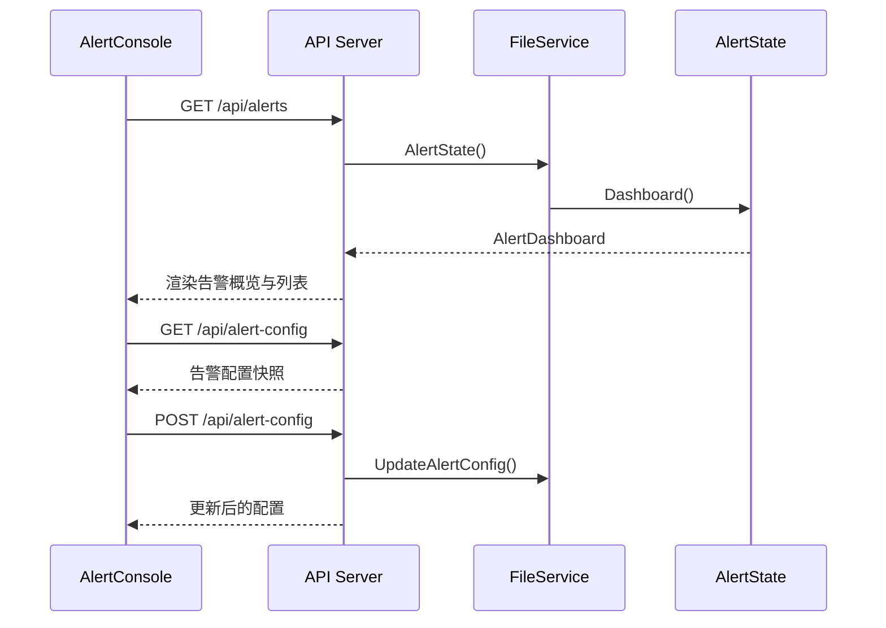
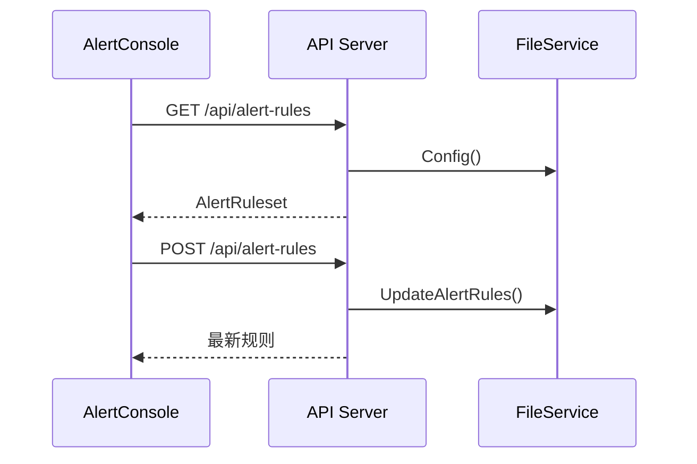
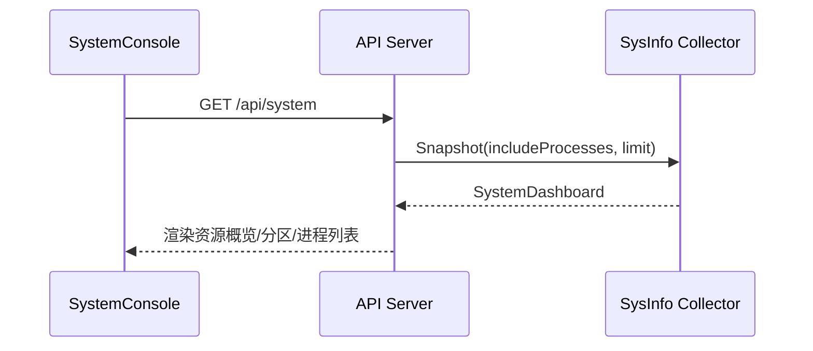

# 前后端联动与时序图说明（Go Watch File）

本文用“不看代码也能理解”的方式说明控制台前端与 Go 后端的联动逻辑，并给出主要时序图与接口说明。

---

## 1. 组件与职责概览

**后端（go-watch-file）**
- 负责监控文件、入队上传、记录状态、汇总仪表盘数据。
- 提供 HTTP API：仪表盘、自动上传开关、手动上传、文件 Tail/检索、AI 日志分析、运行时配置更新。
- 告警决策与告警配置 API：`/api/alerts`、`/api/alert-config`。

**前端（console-frontend）**
- 展示目录树 / 文件列表 / 上传记录 / 队列趋势 / Tail 日志 / AI 总结。
- 通过 API 拉取仪表盘数据，并触发上传与配置更新操作。
- 告警控制台展示风险概览、告警列表与告警配置。

**数据契约**
- 后端聚合结构：`DashboardData`
- 前端类型：`DashboardPayload`
- 字段名一一对齐（`directoryTree`, `metricCards`, `uploadRecords`, `configSnapshot`, `chartPoints` 等）。
- 告警数据结构：`AlertDashboard` 与 `AlertConfigSnapshot`（对应 `/api/alerts` 与 `/api/alert-config`）。

---

## 2. 仪表盘刷新机制（实际实现）

前端有两种刷新模式：
- **全量刷新**（`refreshDashboard`）：页面加载时执行，更新目录树与文件列表。
- **轻量刷新**（`refreshLiveData`）：每 3 秒执行，只更新指标卡、上传记录、监控摘要与趋势图。

这样避免频繁扫描目录导致前端闪动或后台负载升高。
轻量刷新实际调用 `GET /api/dashboard?mode=light` 或 `mode=lite`。

## 2.2 告警控制台刷新机制（实际实现）
- 告警概览与决策列表：每 3 秒轮询 `/api/alerts`。
- 告警配置：首次加载时调用 `/api/alert-config`，保存时调用 `POST /api/alert-config`。
- 告警规则：首次加载时调用 `/api/alert-rules`，保存时调用 `POST /api/alert-rules`。

---

## 3. 关键联动流程

### 3.1 仪表盘自动刷新



### 3.2 手动上传



### 3.3 自动上传开关



### 3.4 文件 Tail



补充：传入 `query` 会进入检索模式，返回 `mode: "search"`、`matched`、`truncated` 与 `lines`。

### 3.5 AI 日志分析



说明：需后端开启 `ai_enabled` 并配置 `AI_*`。

### 3.6 告警控制台刷新与配置



规则加载与保存：


### 3.7 系统资源管理控制台刷新



补充说明：
- 需在控制台开启 `systemResourceEnabled`，否则 `/api/system` 返回 403。
- `mode=lite` 会跳过进程列表采集，降低采样开销。
- `limit` 控制返回的进程数量；`0` 表示不限制。
- IO/CPU 速率为相邻两次采样的差值计算，首次请求可能为 `--`。

---

## 4. API 接口清单（面向前端）

**1) 获取仪表盘**
- `GET /api/dashboard`
- 可选：`mode=light` / `mode=lite` 返回轻量数据（不含目录树/文件列表）
- 返回：`DashboardData`

**2) 切换自动上传**
- `POST /api/auto-upload`
- 请求体：`{ "path": "...", "enabled": true }`

**3) 手动上传**
- `POST /api/manual-upload`
- 请求体：`{ "path": "..." }`

**4) 更新配置**
- `POST /api/config`
- 请求体：
  ```json
  {
    "watchDir": "/path/to/watch",
    "fileExt": ".log",
    "uploadWorkers": 3,
    "uploadQueueSize": 100,
    "uploadRetryDelays": "1s,2s,5s",
    "uploadRetryEnabled": true,
    "silence": "10s",
    "systemResourceEnabled": true
  }
  ```

**5) 文件 Tail**
- `POST /api/file-log`
- 请求体：`{ "path": "...", "query": "keyword", "limit": 500, "caseSensitive": false }`
- 说明：不传 `query` 时读取文件尾部（最多 512KB / 500 行）；传入 `query` 时全文检索（默认最多 2000 行）。

**6) AI 日志分析**
- `POST /api/ai/log-summary`
- 请求体：`{ "path": "...", "mode": "tail", "query": "", "limit": 200, "caseSensitive": false }`
- 说明：需启用 `ai_enabled` 并配置 `AI_*`。

**7) 健康检查**
- `GET /api/health`
- 返回：`{ queue, workers, inFlight, queueFullTotal, retryTotal, uploadFailureTotal, failureReasons }`

**8) 告警面板**
- `GET /api/alerts`
- 返回：`{ ok, enabled, data }`，`data` 为 `AlertDashboard`

**9) 告警配置**
- `GET /api/alert-config`
- `POST /api/alert-config`
- 用途：读取与更新告警配置（如可写则持久化到 `config.runtime.yaml`）

**10) 告警规则**
- `GET /api/alert-rules`
- `POST /api/alert-rules`
- 用途：读取与保存告警规则（持久化到 `config.runtime.yaml`）

**11) 系统资源面板**
- `GET /api/system`
- Query：`mode=lite` / `limit`
- 返回：`SystemDashboard`
- 说明：需开启 `systemResourceEnabled`，否则返回 403。

---

## 5. 注意事项
- `/api/config` 更新运行态配置，并在可写时持久化到 `config.runtime.yaml`；S3 与通知配置需改 `.env` 并重启。
- `/api/alert-config` 更新告警相关配置，并在可写时持久化到 `config.runtime.yaml`（不写回 `config.yaml`）。
- `/api/alert-rules` 保存规则后写入 `config.runtime.yaml`；未保存的规则刷新会被覆盖。
- `/api/ai/log-summary` 需要开启 `ai_enabled`，并配置 `AI_*`。
- 告警概览统计窗口为最近 24 小时。
- 前端的 `concurrency` 字段是字符串（例如 `workers=3 / queue=100`），保存时解析成数值。
- 如需完整字段解释与格式约定，参考 `docs/state-types-visual.md`。
