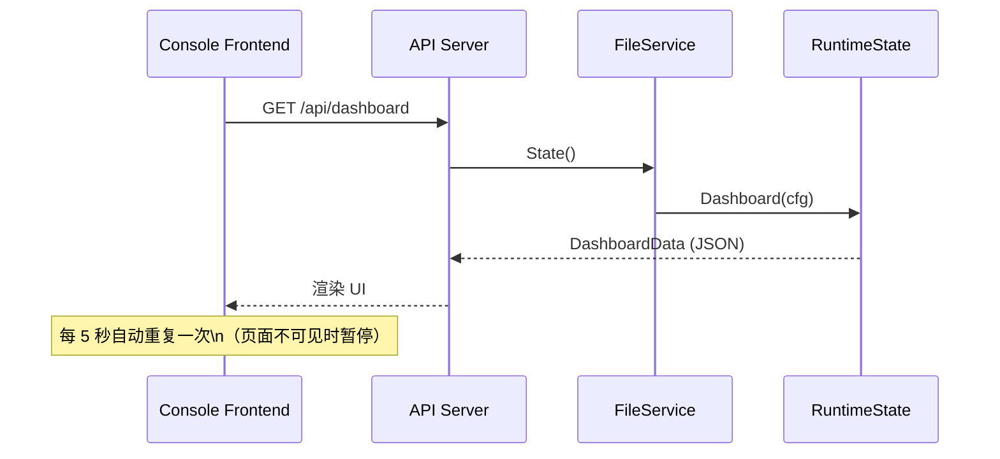
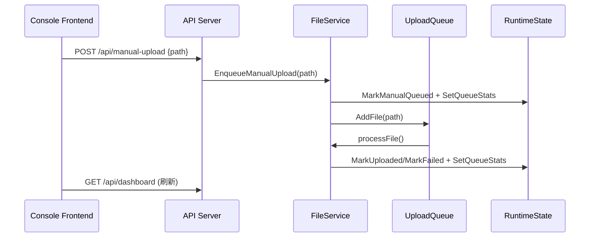
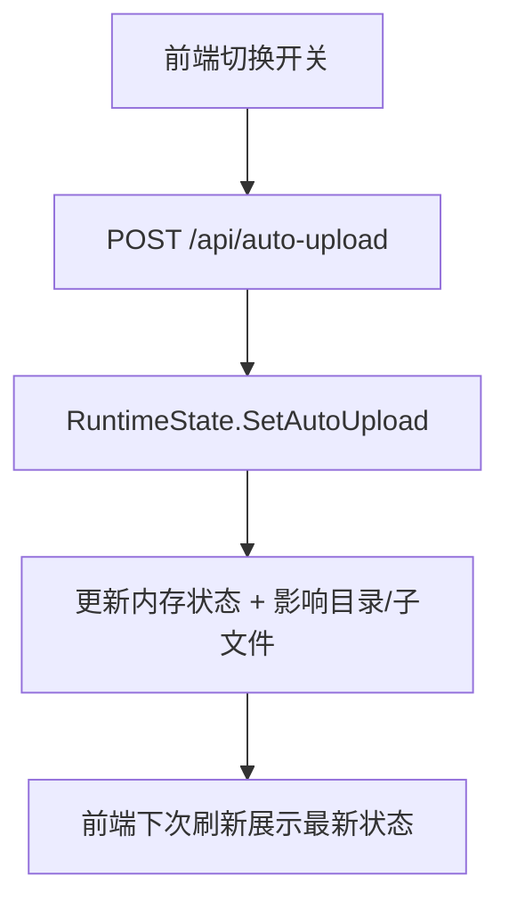

# 前后端联动与时序图说明（Go Watch File）

本文用“不看代码也能理解”的方式说明控制台前端与 Go 后端的联动逻辑，并给出 Mermaid 时序图与流程图。

---

## 1. 组件与职责概览

**后端（Go 服务）**
- 负责监控文件、入队上传、记录状态、汇总仪表盘数据。
- 对外提供 HTTP API，供前端拉取数据或触发操作。

**前端（Console UI）**
- 负责展示“目录树 / 文件列表 / 指标卡 / 上传历史 / 时间线”等。
- 通过接口拉取“仪表盘聚合数据”，并发起“自动上传开关 / 手动上传 / 配置更新”等请求。

**数据契约**
- 后端聚合结构：`DashboardData`
- 前端类型：`DashboardPayload`
- 字段名完全对齐（例如 `directoryTree`, `metricCards`, `uploadRecords` 等）

---

## 2. 关键数据结构（DashboardData）

这是前端渲染的主输入（一次请求返回全部面板数据）：

- `heroCopy`：顶部摘要（主机名、监控目录、并发、队列等）
- `metricCards`：概览指标卡（今日上传、失败率等）
- `directoryTree`：目录树结构（目录/文件/自动上传/大小/更新时间）
- `files`：文件列表表格数据
- `tailLines`：日志 Tail 内容
- `timelineEvents`：时间线事件（成功/失败/告警）
- `routes`：路由规则提示（UI 展示）
- `monitorNotes`：监控说明/配置说明
- `uploadRecords`：上传记录（成功/失败/待处理）
- `monitorSummary`：摘要指标（吞吐、失败率、backlog 等）
- `configSnapshot`：当前配置快照（供前端表单展示）
- `chartPoints`：折线图数据（上传/失败/队列趋势）

---

## 3. 自动刷新机制（前端）

前端页面会自动刷新数据，逻辑如下：

- 页面加载后立即拉取一次 `/api/dashboard`。
- 默认 **每 5 秒** 自动刷新（页面不可见时暂停刷新）。
- 刷新过程中做“防重入”处理，避免并发多次拉取。

这意味着你不用手动刷新页面，列表、指标、时间线会自动更新。

---

## 4. 主要联动流程

### 4.1 仪表盘自动刷新（时序图）



### 4.2 手动上传流程（时序图）



### 4.3 自动上传开关（流程图）



---

## 5. API 接口清单（面向前端）

**1) 获取仪表盘**
- 方法：`GET /api/dashboard`
- 用途：一次性获取所有 UI 面板数据
- 返回：`DashboardData` 的 JSON

**2) 切换自动上传**
- 方法：`POST /api/auto-upload`
- 请求体示例：
  ```json
  { "path": "/path/to/dir-or-file", "enabled": true }
  ```
- 返回：`{ ok: true, path, status }`

**3) 手动上传**
- 方法：`POST /api/manual-upload`
- 请求体示例：
  ```json
  { "path": "/path/to/file" }
  ```
- 返回：`{ ok: true, path }`

**4) 更新配置**
- 方法：`POST /api/config`
- 请求体示例：
  ```json
  {
    "watchDir": "/path/to/watch",
    "fileExt": ".log",
    "uploadWorkers": 3,
    "uploadQueueSize": 100,
    "silence": "10s"
  }
  ```
- 返回：`{ ok: true, config: ConfigSnapshot }`

**5) 健康检查**
- 方法：`GET /api/health`
- 返回：`{ queue, workers }`

---

## 6. 后端状态更新机制（核心细节）

**状态存储**
- 运行态存在内存中，核心字段包括：
  - `fileState`：单文件状态（queued/uploaded/failed/existing）
  - `tailLines`：尾部日志
  - `timeline`：时间线事件
  - `uploads`：上传历史
  - `queue`：折线图点

**文件生命周期**
1. **新文件进入队列**：记录为 `queued`（自动/手动入队）
2. **上传成功**：标记为 `uploaded` 并记录耗时
3. **上传失败**：标记为 `failed`，并记录失败原因
4. **历史文件**：启动时扫描目录，标记为 `existing`

**自动上传继承**
- 目录级开关会影响子目录和子文件。
- 若目录关闭自动上传，文件会被标为“需审批/手动”。

---

## 7. 目录树与文件列表如何生成

**目录树**
- 后端会扫描监控目录，构建树状结构。
- 每个节点包含：`name/path/type/autoUpload/size/updated/content` 等。
- 构建完成后进行排序，保证展示稳定一致。

**文件列表**
- 目录扫描与内存状态合并。
- 每个文件包含 `status`（queued/uploaded/failed/existing）和 `requiresApproval`。

---

## 8. 配置更新的联动影响

当你在前端保存配置时：

- 后端会重新创建运行态与监控器（新的 watcher / pool）。
- 会继承旧状态的计数与历史，保证“统计连续性”。
- 如果新配置启动失败，会尽力回滚到旧配置。

---

## 9. 常见问题与排查建议

**Q1：前端没有数据/界面不刷新**
- 确认后端服务已启动并监听端口。
- 检查前端 `VITE_API_BASE` 是否正确。
- 看是否有跨域问题（后端已允许 CORS）。

**Q2：新文件没有出现**
- 检查 `watchDir` 是否正确、是否存在。
- 看是否设置了后缀过滤（`fileExt`）。
- 自动上传关闭时，文件会进入“需审批/手动”状态。

**Q3：上传失败**
- 查看上传记录与时间线事件。
- 失败原因会进入 `uploadRecords.note`。

---

## 10. 快速理解版（如果你不看代码）

你只需要记住一句话：

**前端每 5 秒请求一次 `/api/dashboard`，后端把所有状态打包返回，前端直接渲染。**

所有操作（手动上传、配置修改、自动上传开关）都是通过 API 请求触发后端更新，然后下一次刷新就能看到变化。
