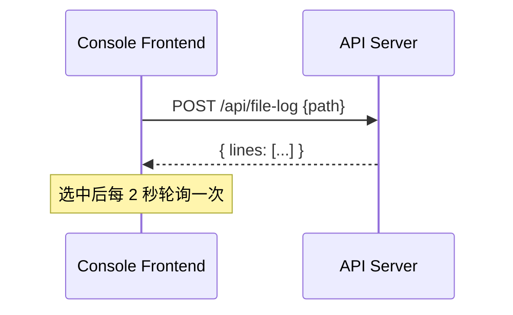

# 前后端联动与时序图说明（Go Watch File）

本文用“不看代码也能理解”的方式说明控制台前端与 Go 后端的联动逻辑，并给出主要时序图与接口说明。

---

## 1. 组件与职责概览

**后端（go-watch-file）**
- 负责监控文件、入队上传、记录状态、汇总仪表盘数据。
- 提供 HTTP API：仪表盘、自动上传开关、手动上传、文件 Tail、运行时配置更新。

**前端（console-frontend）**
- 展示目录树 / 文件列表 / 上传记录 / 队列趋势 / Tail 日志。
- 通过 API 拉取仪表盘数据，并触发上传与配置更新操作。

**数据契约**
- 后端聚合结构：`DashboardData`
- 前端类型：`DashboardPayload`
- 字段名一一对齐（`directoryTree`, `metricCards`, `uploadRecords`, `configSnapshot`, `chartPoints` 等）。

---

## 2. 仪表盘刷新机制（实际实现）

前端有两种刷新模式：
- **全量刷新**（`refreshDashboard`）：页面加载时执行，更新目录树与文件列表。
- **轻量刷新**（`refreshLiveData`）：每 3 秒执行，只更新指标卡、上传记录、监控摘要与趋势图。

这样避免频繁扫描目录导致前端闪动或后台负载升高。

---

## 3. 关键联动流程

### 3.1 仪表盘自动刷新


### 3.2 手动上传


### 3.3 自动上传开关


### 3.4 文件 Tail



---

## 4. API 接口清单（面向前端）

**1) 获取仪表盘**
- `GET /api/dashboard`
- 返回：`DashboardData`

**2) 切换自动上传**
- `POST /api/auto-upload`
- 请求体：`{ "path": "...", "enabled": true }`

**3) 手动上传**
- `POST /api/manual-upload`
- 请求体：`{ "path": "..." }`

**4) 更新配置**
- `POST /api/config`
- 请求体：
  ```json
  {
    "watchDir": "/path/to/watch",
    "fileExt": ".log",
    "uploadWorkers": 3,
    "uploadQueueSize": 100,
    "silence": "10s"
  }
  ```

**5) 文件 Tail**
- `POST /api/file-log`
- 请求体：`{ "path": "..." }`
- 限制：最多 512KB / 500 行，仅文本文件。

**6) 健康检查**
- `GET /api/health`
- 返回：`{ queue, workers }`

---

## 5. 注意事项
- `/api/config` 仅更新运行态配置，S3 与通知配置需改文件并重启。
- 前端的 `concurrency` 字段是字符串（例如 `workers=3 / queue=100`），保存时解析成数值。
- 如需完整字段解释与格式约定，参考 `docs/state-types-visual.md`。
