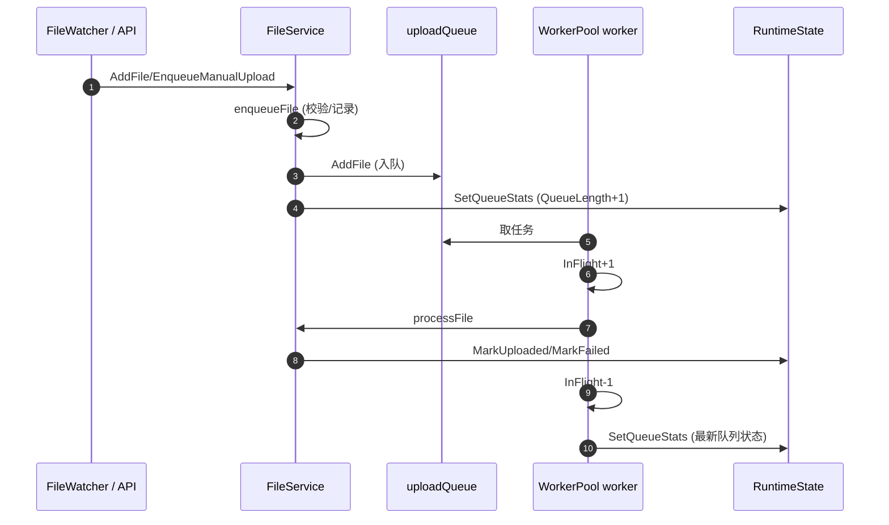

# 上传队列与 Worker 流程说明

> 目的：解释“排队/处理中/队列深度/最新队列状态”等概念的含义与统计方式，避免把“队列容量”与“队列数量”混淆。

## 1. 整体流程（从文件出现到 UI 展示）

```
文件出现/手动触发
        ↓
FileService.enqueueFile
        ↓ (QueueLength+1)
uploadQueue 入队
        ↓
worker 取出任务 → InFlight+1（QueueLength-1）
        ↓
processFile 执行上传
        ↓
上传成功/失败 → 记录状态
        ↓
worker 完成 → InFlight-1 → 更新最新队列状态
        ↓
/api/dashboard 返回 → 前端轮询刷新
```

说明：**QueueLength 只统计等待中的任务，InFlight 统计处理中任务**。
UI 的“队列深度/backlog”显示的是 `QueueLength + InFlight`。

## 2. 关键时序（入队与 worker 消费）



## 3. 文件入队逻辑（发生了什么）

1) **来源**
   - 自动：`FileWatcher` 发现文件变化，回调 `FileService.AddFile()`
   - 手动：前端调用 `/api/manual-upload`，触发 `FileService.EnqueueManualUpload()`

2) **入队前校验**
   - 规范化路径
   - 自动模式下检查是否开启自动上传
   - 若不需要上传，记录为 `skipped`

3) **记录状态**
   - `MarkQueued/MarkManualQueued` 记录“进入队列”
   - 追加 tail/timeline/upload 记录（`result=pending`）

4) **真正入队**
   - `uploadPool.AddFile(filePath)`（非阻塞）
   - 队列满返回 `upload queue full`
   - 入队成功后更新统计（QueueLength + 1）

5) **队列满/池关闭处理**
   - 入队失败会调用 `MarkFailed` 并刷新队列状态

## 4. uploadQueue 概念（定义、作用、边界）

### 4.1 uploadQueue 是什么
- 本质是一个带缓冲的 `chan string`，保存“待上传文件路径”。

### 4.2 解决的问题
- **生产者/消费者解耦**：监控线程只负责入队。
- **缓冲突发流量**：短时间大量文件时队列承接压力。
- **背压提示**：队列满会返回错误，提示系统拥塞。

### 4.3 与容量（UploadQueueSize）的区别
- `UploadQueueSize` 是容量上限，不是当前数量。
- 当前任务数量以 `QueueLength + InFlight` 为准。

### 4.4 使用边界
- 默认仅存在内存中，服务重启后队列清空。
- 开启 `upload_queue_persist_enabled` 后，任务会落盘并在重启后恢复，语义为“至少一次”。
- 当前不做去重，极端故障场景下同一路径可能被重复处理。

## 5. Worker 完成的“任务”是什么

worker 处理一个任务的流程（对应 `processFile`）：
1) 判断自动上传是否开启（或手动触发）。
2) 上传到 S3（对象存储，失败按配置重试）。
3) 记录上传结果（成功/失败、耗时、目标地址）。
4) 发送通知（钉钉通知/邮件通知）。

所以“worker 完成一个任务”指：**一个文件的上传流程结束（成功或失败）**。

## 6. 统计口径与“最新队列状态”

`WorkerPool.GetStats()` 输出快照：
- **QueueLength**：`len(uploadQueue)`（等待中的任务）。
- **InFlight**：worker 已取走但尚未完成的任务。
- **Workers**：当前 worker 数量。

`RuntimeState.SetQueueStats()` 将队列深度记录为：
```
queueLen = QueueLength + InFlight
```
并追加图表点（默认最多 32 个）。

## 7. UI 展示口径
当前 UI 中涉及“队列”的显示均使用 **队列深度（QueueLength + InFlight）**：
- 总览卡片：队列深度
- 运行监控摘要：队列 backlog
- 图表趋势：queue

## 8. 关键代码位置
- `go-watch-file/internal/upload/worker_pool.go`
  - `uploadQueue` 队列
  - `inFlight` 处理中计数
  - `GetStats()` 输出统计快照

- `go-watch-file/internal/service/file_service.go`
  - `enqueueFile` 入队后更新统计
  - `handlePoolStats` 接收 worker 完成后的统计更新

- `go-watch-file/internal/state/state.go`
  - `SetQueueStats` 计算队列深度并写入状态

- `console-frontend/src/App.tsx`
  - 定时拉取 `/api/dashboard`
  - 展示队列深度与图表趋势
