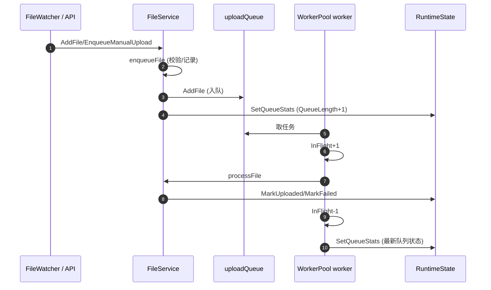

# 上传队列与 Worker 流程说明

> 目的：解释“排队/处理中/队列深度/最新队列状态”等概念的含义与统计方式，避免把“队列容量”与“队列数量”混淆。

## 1. 整体流程（从文件出现到 UI 展示）

```
文件出现/手动触发
        ↓
FileService.enqueueFile
        ↓ (QueueLength+1)
uploadQueue 入队
        ↓
worker 取出任务 → InFlight+1（QueueLength-1）
        ↓
processFile 执行上传
        ↓
上传成功/失败 → 记录状态
        ↓
worker 完成 → InFlight-1 → 更新最新队列状态
        ↓
/dashboard 返回 → 前端轮询刷新
```

注意：**worker 取走任务时，QueueLength 会减少、InFlight 会增加，但 backlog 总量不变**，所以只在“入队”和“完成”时更新统计即可。

## 2. 时序图（入队与 worker 消费）



## 3. 文件入队逻辑（发生了什么，和 worker 的关系）

文件“入队”由 `FileService.enqueueFile` 完成，核心步骤如下：

1. **来源**  
   - 自动：`FileWatcher` 发现文件变化，回调 `FileService.AddFile()`  
   - 手动：前端调用 `/api/manual-upload`，触发 `FileService.EnqueueManualUpload()`

2. **入队前校验**  
   - 规范化路径  
   - 自动模式下检查是否开启自动上传  
   - 若不需要上传，则记录为 `skipped` 并结束

3. **记录状态**  
   - `MarkQueued/MarkManualQueued` 记录“进入队列”  
   - 追加 tail/timeline/upload 记录

4. **真正入队**  
   - 调用 `uploadPool.AddFile(filePath)`  
   - 本质上是把路径写入 `uploadQueue`（带缓冲的 channel）
   - 成功后更新队列统计（QueueLength + 1）

5. **与 worker 的关系**  
   - 入队本身与 worker **没有直接耦合**  
   - worker 只是从 `uploadQueue` 里取任务并处理  
   - worker 取走任务时：QueueLength - 1，InFlight + 1  
   - worker 处理完成时：InFlight - 1，并更新最新队列状态

总结：**入队是“把任务放进队列”，worker 是“从队列里消费任务”**。两者通过 `uploadQueue` 关联，但逻辑上是解耦的。

## 4. uploadQueue 概念（定义、作用、边界）

### 4.1 uploadQueue 是什么
- 本质是一个带缓冲的 `chan string`，保存“待上传文件路径”。
- 每个元素代表一个“等待处理的上传任务”。
- 定义位置：`go-watch-file/internal/upload/worker_pool.go`

### 4.2 解决的问题
- **生产者/消费者解耦**：文件被发现后先入队，worker 何时处理由其自身节奏决定。
- **缓冲突发流量**：短时间大量文件时，队列承接突发流量，避免直接丢任务。
- **背压提示**：队列满会返回 `upload queue full`，提示系统已拥塞。

### 4.3 与容量（UploadQueueSize）的区别
- `UploadQueueSize` 是**容量上限**，不是当前数量。
- 当前任务数量以 QueueLength/InFlight 为准。

### 4.4 使用边界
- 仅存在内存中，服务重启后队列清空。
- 不做持久化，不保证“消息必达”，适合实时上传任务。

## 5. Worker 完成的“任务”是什么

worker 处理一个任务时执行的主要流程（对应 `processFile`）：

1. 校验是否需要上传（自动/手动、过滤规则等）。
2. 将文件上传到 S3（或兼容对象存储）。
3. 记录上传结果（成功/失败、耗时、目标地址）。
4. 发送通知（钉钉等）。

所以“worker 完成一个任务”指：**一个文件的上传流程结束（成功或失败）**。

## 6. 统计口径与“最新队列状态”

“最新队列状态”来自 `WorkerPool.GetStats()` 的实时统计快照：

- **QueueLength（排队数量）**：`len(uploadQueue)`，只统计“等待中”的任务。
- **InFlight（处理中数量）**：worker 已取走但尚未完成的任务。
- **Workers（工作协程数）**：当前 worker 数量。
- **队列深度/backlog（展示口径）**：`QueueLength + InFlight`。

这个快照在以下时机更新：

1. **任务入队后**（AddFile 成功后）
2. **任务处理完成后**（worker 处理完，InFlight--）

这些更新会写入 RuntimeState，并最终通过 `/api/dashboard` 返回给前端。

## 7. 示例（更直观的数字变化）

假设 workers=2：

- **情况 A：一个文件正在上传**
  - QueueLength = 0
  - InFlight = 1
  - 队列深度 = 1
  - UI 会显示 1（即“系统当前有 1 个任务在处理中”）

- **情况 B：5 个文件同时到达**
  - workers=2 会立即处理 2 个任务
  - QueueLength = 3（等待中）
  - InFlight = 2（处理中）
  - 队列深度 = 5

- **情况 C：任务处理很快**
  - QueueLength 可能瞬间从 1 变 0
  - 但 InFlight 能反映“处理中”，避免 UI 一直显示 0

## 8. UI 展示口径

当前 UI 中涉及“队列”的显示均使用 **队列深度（QueueLength + InFlight）**：

- 总览卡片：队列深度
- 运行监控小卡：队列 backlog
- 头部摘要：队列 X
- 图表趋势：queue

如果未来需要拆开显示“排队数量”和“处理中数量”，可以在 API 中返回两个字段，前端分别展示。

## 9. 关键代码位置（便于追溯）

- `go-watch-file/internal/upload/worker_pool.go`
  - `uploadQueue` 队列
  - `inFlight` 处理中计数
  - `GetStats()` 输出统计快照

- `go-watch-file/internal/service/file_service.go`
  - `enqueueFile` 入队后更新统计
  - `handlePoolStats` 接收 worker 完成后的统计更新

- `go-watch-file/internal/state/state.go`
  - `SetQueueStats` 计算队列深度并写入状态

- `console-frontend/src/App.tsx`
  - 定时拉取 `/api/dashboard`
  - 展示队列深度

## 10. 常见误解澄清

- **“队列大小为 100 就表示有 100 个任务？”**
  不是，100 只是容量上限。当前任务数看 QueueLength + InFlight。

- **“队列一直是 0，是不是没在上传？”**
  以前是，因为只统计 QueueLength；任务被 worker 立即取走后队列为 0。
  现在加入 InFlight 后，上传中也会显示为非 0。

如果你希望在 UI 明确显示两列（排队 / 处理中），我可以继续补充 API 与前端展示。
