# state/types.go 结构体图例说明（详细版）

本文以 Mermaid 图例方式展示 `go-watch-file/internal/state/types.go` 的 DTO（后端返回给前端的数据结构），并解释字段含义、生成方式与 UI 对应关系。

---

## 1. 数据流总览

```mermaid
flowchart LR
  A[Config 配置] --> B[RuntimeState 运行态]
  B --> C[Dashboard() 聚合]
  C --> D[/api/dashboard JSON]
  D --> E[前端 App.tsx 渲染]
```

---

## 2. DashboardData（聚合结构）

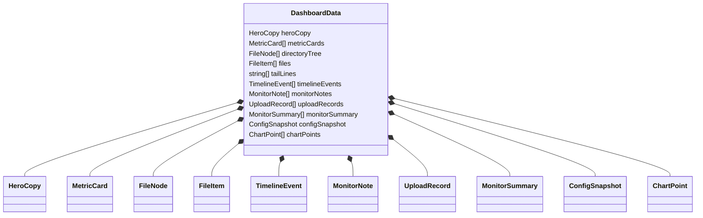

来源与组装（对应 `RuntimeState.Dashboard`）：
```mermaid
flowchart TB
  A[Dashboard()] --> B[HeroCopy(cfg)]
  A --> C[MetricCards()]
  A --> D[DirectoryTree()]
  A --> E[FileItems()]
  A --> F[TailLines()]
  A --> G[TimelineEvents()]
  A --> H[MonitorNotes(cfg)]
  A --> I[UploadRecords()]
  A --> J[MonitorSummary()]
  A --> K[ConfigSnapshot(cfg)]
  A --> L[ChartPoints()]
```

**补充说明**
- `tailLines` 是**运行态日志**（入队/成功/失败等），不是文件内容。文件内容 Tail 使用 `/api/file-log`。
- 内存列表有上限：`tailLines` 200、`timelineEvents` 120、`uploadRecords` 200、`chartPoints` 32。

---

## 3. UI 面板与数据绑定

```mermaid
flowchart TB
  A[overview 总览] --> A1[heroCopy]
  A --> A2[metricCards]
  B[config 配置] --> B1[configSnapshot]
  C[directory 目录树] --> C1[directoryTree]
  D[files 文件列表] --> D1[files]
  E[tail 文件日志] --> E1[/api/file-log]
  F[failures 上传记录] --> F1[uploadRecords]
  G[monitor 监控] --> G1[monitorSummary]
  G --> G2[monitorNotes]
  G --> G3[chartPoints]
```

---

## 4. 枚举与格式约定

```mermaid
flowchart TB
  A[FileNode.type] --> A1[dir=目录]
  A --> A2[file=文件]

  B[FileItem.status] --> B1[queued=入队]
  B --> B2[uploaded=成功]
  B --> B3[failed=失败]
  B --> B4[existing=历史/未上传]

  C[TimelineEvent.status] --> C1[info=提示]
  C --> C2[success=成功]
  C --> C3[warning=警告]
  C --> C4[danger=错误]

  D[UploadRecord.result] --> D1[success=成功]
  D --> D2[failed=失败]
  D --> D3[pending=等待]

  E[时间格式] --> E1[time/updated: YYYY-MM-DD HH:MM:SS]
  E --> E2[chartPoints.label: HH:MM]

  F[大小/耗时] --> F1[size: 12 KB / 1.2 MB / 0.9 GB]
  F --> F2[latency: 120 ms 或 --]
```

---

## 5. 结构体详解

### 5.1 FileNode（目录树节点）

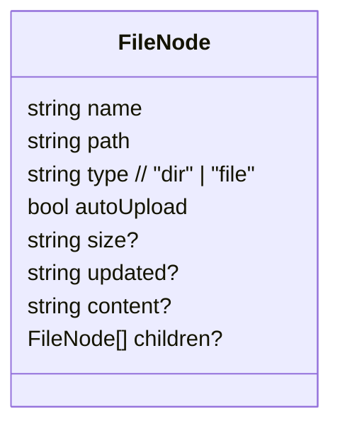

字段说明：
- `name`：展示名；根节点通常为 `watch_dir` 的完整路径。
- `path`：规范化路径（`/` 分隔）。
- `autoUpload`：是否自动上传。
- `content`：状态备注（如“自动入队”“上传失败原因”“历史文件”）。

来源：`DirectoryTree()` 扫描磁盘并合并运行态生成。

---

### 5.2 MetricCard（指标卡）

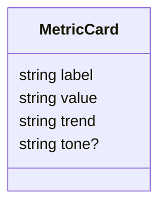

来源：`MetricCards()`
- 统计“今日上传/失败/通知/失败率/队列深度”。
- `tone` 影响 UI 颜色（常见：`up` / `muted` / `warning`）。

---

### 5.3 FileItem（文件列表行）

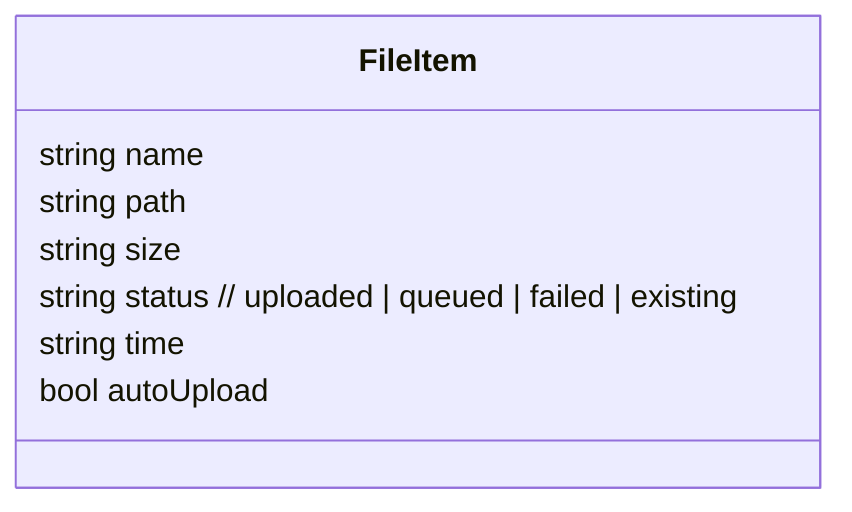

来源：`FileItems()`
- `time` 来自文件修改时间，格式为 `YYYY-MM-DD HH:MM:SS`。
- 列表按时间倒序。

---

### 5.4 TimelineEvent（时间线事件）

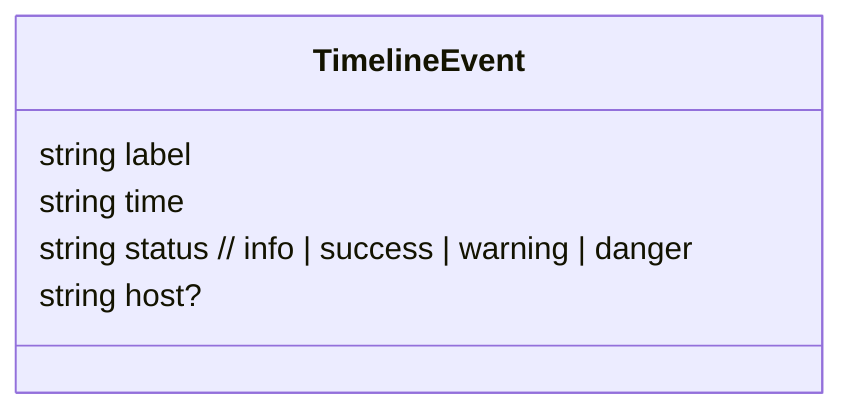

来源：`TimelineEvents()`，记录入队/成功/失败/开关调整等事件。

---

### 5.5 MonitorNote（监控说明）

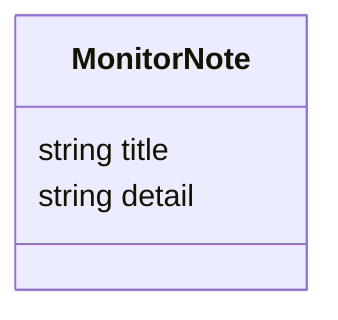

来源：`MonitorNotes(cfg)`，展示 S3 与 worker 配置摘要。

---

### 5.6 ConfigSnapshot（配置表单快照）

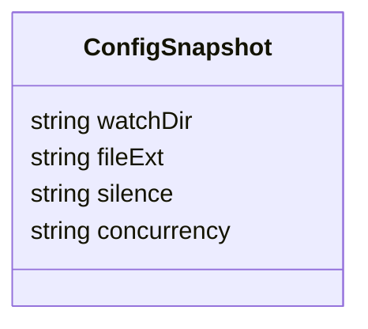

说明：
- `concurrency` 为字符串，格式类似 `workers=3 / queue=100`。
- 前端保存时解析为数值并提交 `/api/config`。

---

### 5.7 HeroCopy（头部摘要）

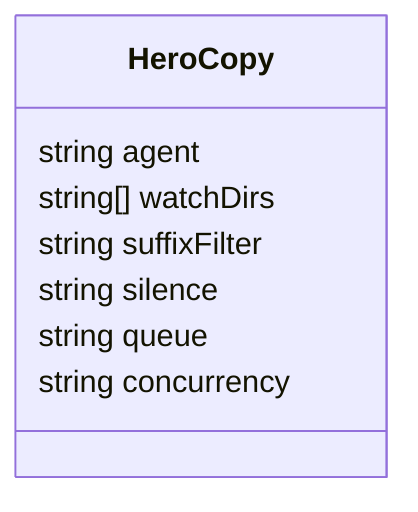

说明：
- `watchDirs` 当前仅包含一个监控目录。
- `suffixFilter` 为空时显示“关闭 · 全量目录”。

---

### 5.8 ChartPoint（趋势图点）

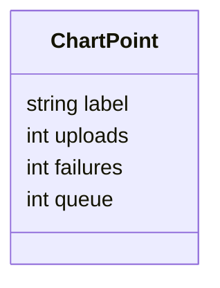

说明：
- `uploads/failures` 为累计值（非区间值）。
- `queue` 为当前队列深度（QueueLength + InFlight）。

---

### 5.9 UploadRecord（上传记录）

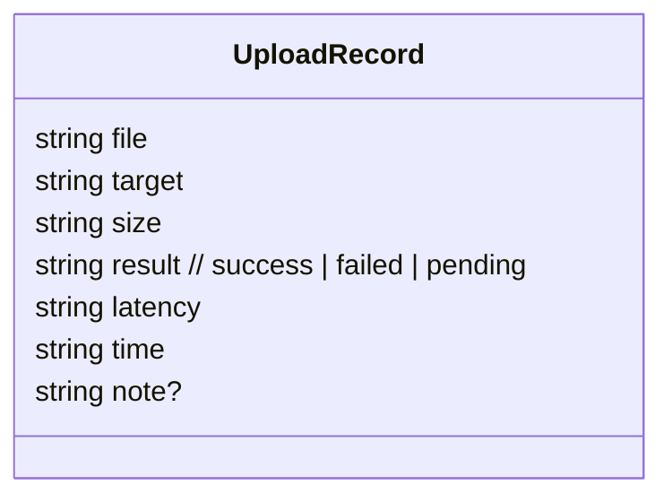

说明：
- `pending` 表示已入队但尚未完成。
- `time` 为空时显示 `--`（例如历史文件初始化）。

---

### 5.10 MonitorSummary（摘要指标）

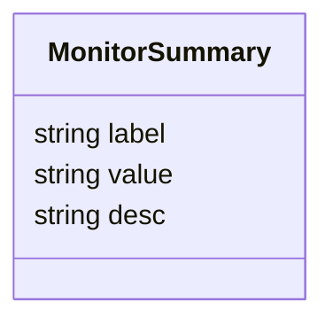

说明：
- 包括“近 1 分钟吞吐”“成功率”“队列 backlog”“失败累计”等指标。

