# state/types.go 结构体图例说明（详细版）

本文以 Mermaid 图例方式展示 `go-watch-file/internal/state/types.go` 的 DTO（后端返回给前端的数据结构），并解释字段含义、生成方式与 UI 对应关系。

---

## 1. 数据流总览

```mermaid
flowchart LR
  A[Config 配置] --> B[RuntimeState 运行态]
  B --> C[Dashboard() 聚合]
  C --> D[/api/dashboard JSON]
  D --> E[前端 App.tsx 渲染]
```

---

## 2. DashboardData（聚合结构）

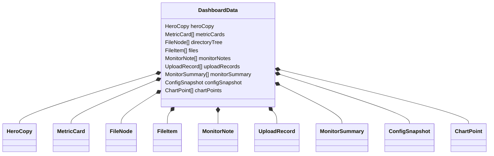

来源与组装（对应 `RuntimeState.Dashboard`）：
```mermaid
flowchart TB
  A[Dashboard()] --> B[HeroCopy(cfg)]
  A --> C[MetricCards()]
  A --> D[DirectoryTree()]
  A --> E[FileItems()]
  A --> F[MonitorNotes(cfg)]
  A --> G[UploadRecords()]
  A --> H[MonitorSummary()]
  A --> I[ConfigSnapshot(cfg)]
  A --> J[ChartPoints()]
```

**补充说明**
- DashboardData 不包含文件内容 Tail/检索，文件内容通过 `/api/file-log` 获取。
- 内存列表有上限：`uploadRecords` 200、`chartPoints` 32。

---

## 3. UI 面板与数据绑定

```mermaid
flowchart TB
  A[overview 总览] --> A1[heroCopy]
  A --> A2[metricCards]
  B[config 配置] --> B1[configSnapshot]
  C[directory 目录树] --> C1[directoryTree]
  D[files 文件列表] --> D1[files]
  E[文件日志/检索] --> E1[/api/file-log]
  F[failures 上传记录] --> F1[uploadRecords]
  G[monitor 监控] --> G1[monitorSummary]
  G --> G2[monitorNotes]
  G --> G3[chartPoints]
```

---

## 4. 枚举与格式约定

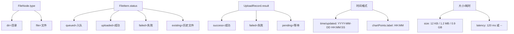

---

## 5. 结构体详解

### 5.1 FileNode（目录树节点）

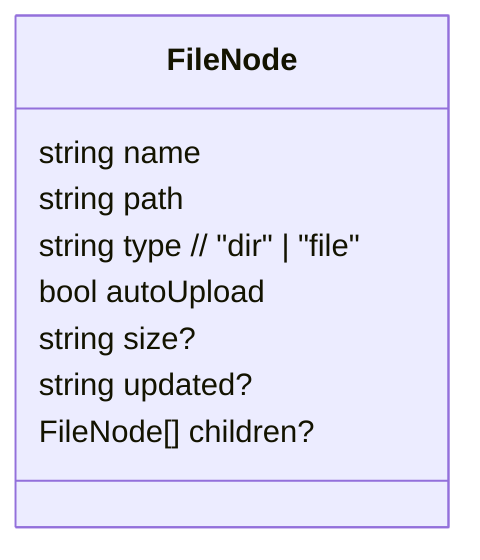

字段说明：
- `name`：展示名；根节点通常为 `watch_dir` 的完整路径。
- `path`：规范化路径（`/` 分隔）。
- `autoUpload`：是否自动上传。
- `size`/`updated`：仅在文件节点返回，目录节点为空。

来源：`DirectoryTree()` 扫描磁盘并合并运行态生成。

---

### 5.2 MetricCard（指标卡）

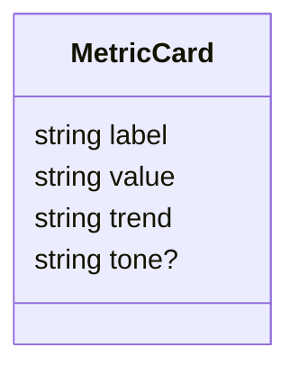

来源：`MetricCards()`
- 统计“今日上传/失败/通知/失败率/队列深度”。
- `tone` 影响 UI 颜色（常见：`up` / `muted` / `warning`）。

---

### 5.3 FileItem（文件列表行）

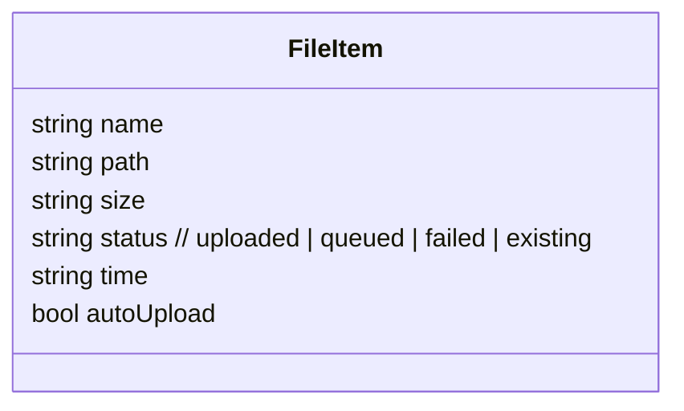

来源：`FileItems()`
- `time` 来自文件修改时间，格式为 `YYYY-MM-DD HH:MM:SS`。
- 列表按时间倒序。

---

### 5.4 MonitorNote（监控说明）

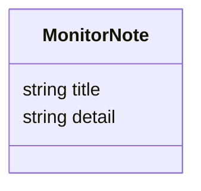

来源：`MonitorNotes(cfg)`，展示 S3 与 worker 配置摘要。

---

### 5.5 ConfigSnapshot（配置表单快照）

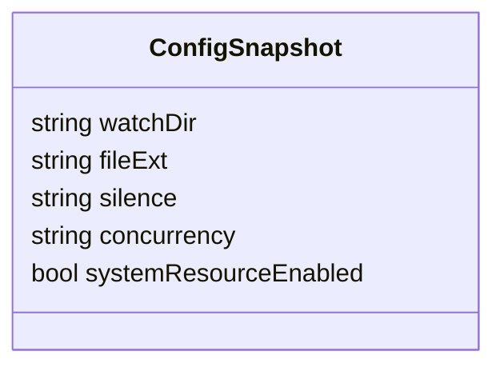

说明：
- `concurrency` 为字符串，格式类似 `workers=3 / queue=100`。
- 前端保存时解析为数值并提交 `/api/config`。
- `systemResourceEnabled` 控制系统资源面板开关，需开启后才能访问 `/api/system`。

---

### 5.6 HeroCopy（头部摘要）

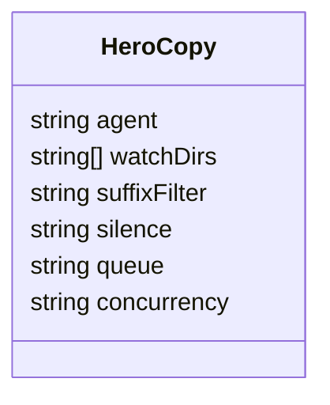

说明：
- `watchDirs` 为监控目录列表，支持多个监控目录。
- `suffixFilter` 为空时显示“关闭 · 全量目录”。

---

### 5.7 ChartPoint（趋势图点）

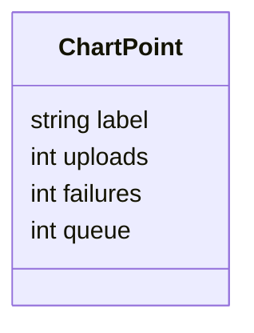

说明：
- `uploads/failures` 为累计值（非区间值）。
- `queue` 为当前队列深度（QueueLength + InFlight）。

---

### 5.8 UploadRecord（上传记录）

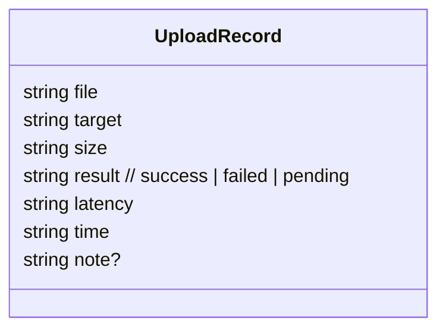

说明：
- `pending` 表示已入队但尚未完成。
- `time` 为入队或完成的时间戳。

---

### 5.9 MonitorSummary（摘要指标）

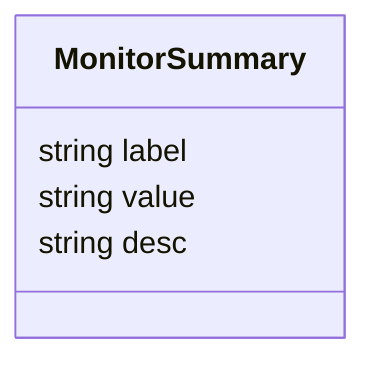

说明：
- 包括“近 1 分钟吞吐”“成功率”“队列 backlog”“失败累计”等指标。

---

## 6. 告警控制台数据结构（AlertDashboard）

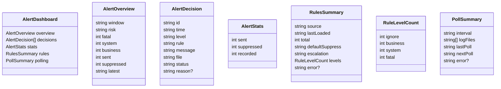

说明：
- `overview.window` 为概览统计窗口文案，当前为最近 24 小时。
- `decisions` 按时间倒序返回，列表只保留最近 200 条。
- `stats` 为累计统计，独立于概览窗口。
- 结构定义来源于 `go-watch-file/internal/alert/state.go` 与 `console-frontend/src/types.ts`。

### 6.1 AlertConfigSnapshot（告警配置快照）

`/api/alert-config` 返回结构示例：
```json
{
  "enabled": true,
  "suppressEnabled": true,
  "rulesFile": "/etc/gwf/alert-rules.yaml",
  "logPaths": "/var/log/app/error.log",
  "pollInterval": "2s",
  "startFromEnd": true
}
```
