# state/types.go 结构体图例说明（详细版）

本文件用 Mermaid 图例方式展示 `go-watch-file/internal/state/types.go` 中每个结构体的字段含义、组合关系、来源与 UI 对应关系。
建议用支持 Mermaid 的 Markdown 预览查看（如 VSCode、GitHub）。

---

## 图例说明

- `string?` 表示字段可选（`omitempty`）。
- `Type`/`Status` 等字段为枚举字符串。
- 关系线说明：
  - `*--` 表示包含关系（聚合/组合）
  - `[]` 表示列表

---

## 数据流总览（后端到前端）


---

## 关键时序图（结构体如何被生成与消费）

### 1) 仪表盘刷新（DashboardData 的生成与消费）
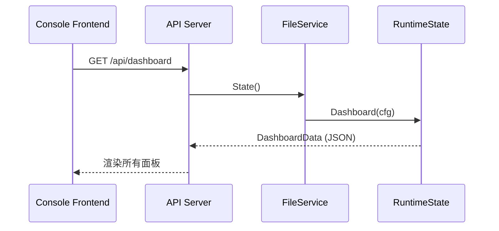

### 2) 配置更新（ConfigSnapshot 的生成与返回）
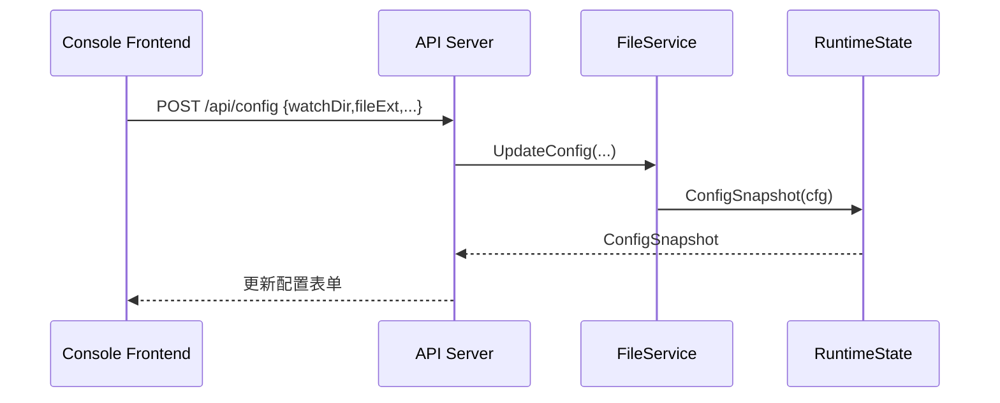

### 3) 上传流程（UploadRecord / TimelineEvent / FileItem 变化）
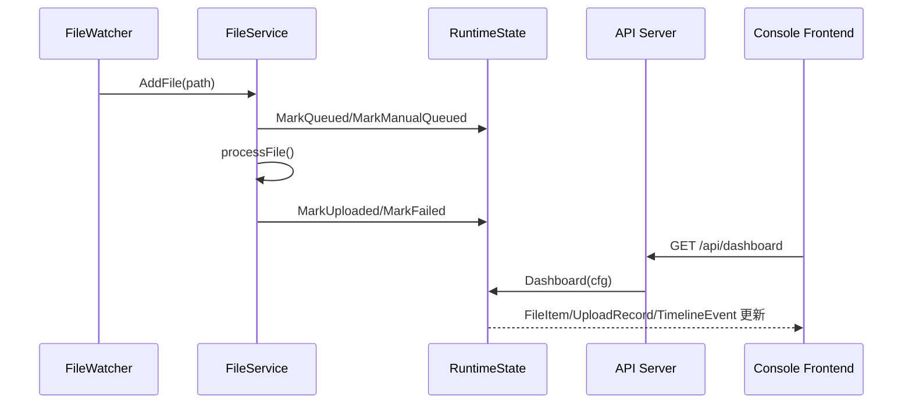

---

## UI 面板与数据绑定关系

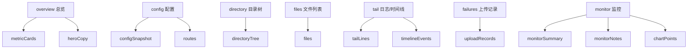

---

## 枚举与格式约定（关键字段取值）

```mermaid
flowchart TB
  A["FileNode.type"] --> A1["dir=目录"]
  A --> A2["file=文件"]

  B["FileItem.status"] --> B1["queued=入队"]
  B --> B2["uploaded=成功"]
  B --> B3["failed=失败"]
  B --> B4["existing=历史/未上传"]

  C["TimelineEvent.status"] --> C1["info=提示"]
  C --> C2["success=成功"]
  C --> C3["warning=警告"]
  C --> C4["danger=错误"]

  D["UploadRecord.result"] --> D1["success=成功"]
  D --> D2["failed=失败"]
  D --> D3["pending=等待"]

  E["时间格式"] --> E1["time/updated: HH:MM:SS"]
  E --> E2["chartPoints.label: HH:MM"]

  F["大小/耗时"] --> F1["size: 12 KB / 1.2 MB / 0.9 GB"]
  F --> F2["latency: 120 ms 或 --"]
```

---

## 全局聚合结构（DashboardData）

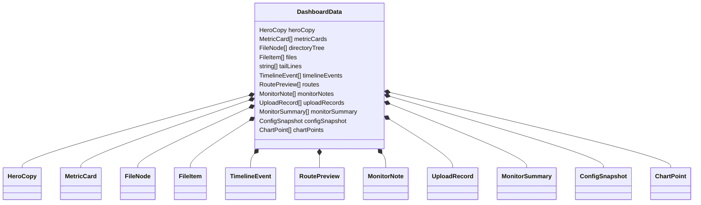

来源与组装（对应 `RuntimeState.Dashboard` 中的构建函数）：
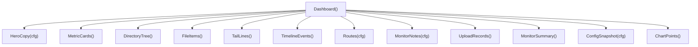

---

## FileNode（目录树节点）

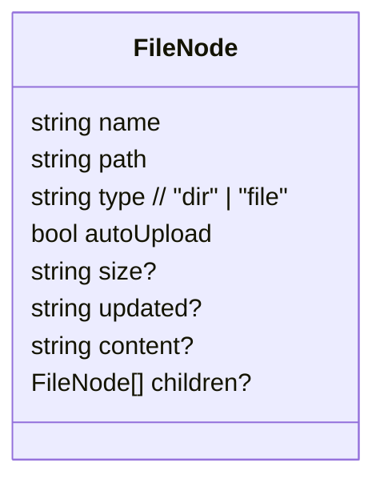

字段含义图：
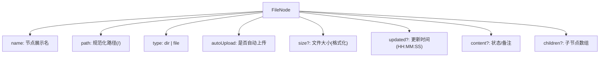

示例（树结构）：
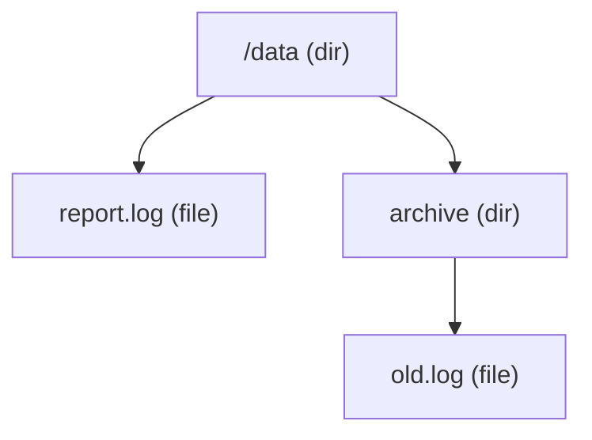

来源：`DirectoryTree()` 扫描磁盘并合并运行态后生成。

---

## MetricCard（指标卡）

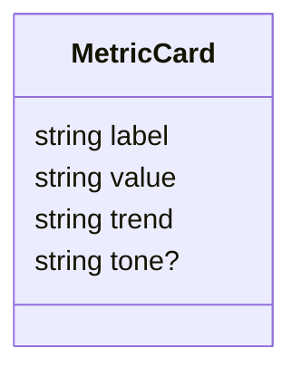

字段含义图：
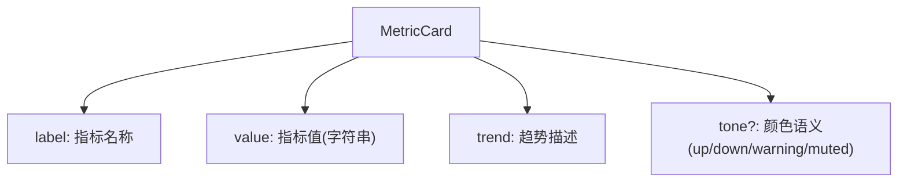

示例（卡片）：
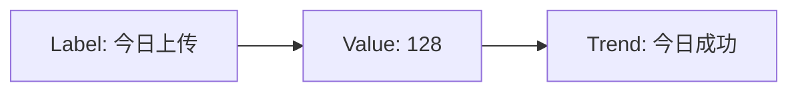

来源：`MetricCards()` 根据当天上传/失败/通知统计构建。

---

## FileItem（文件列表行）

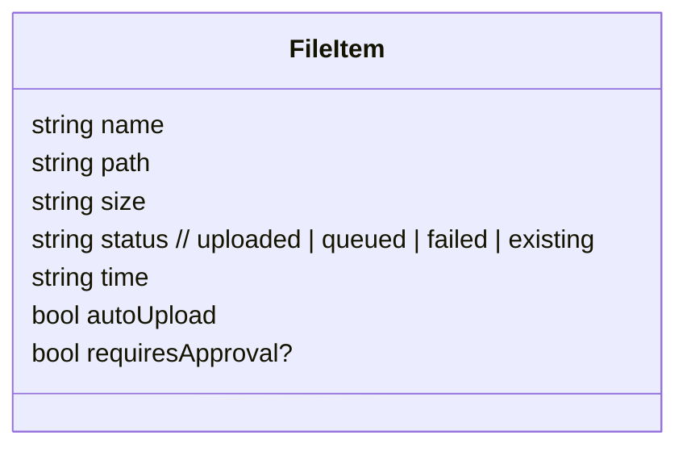

字段含义图：
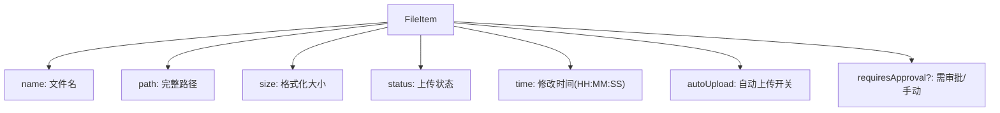

示例（表格行）：


来源：`FileItems()` 扫描磁盘并合并运行态后生成。

---

## TimelineEvent（时间线事件）

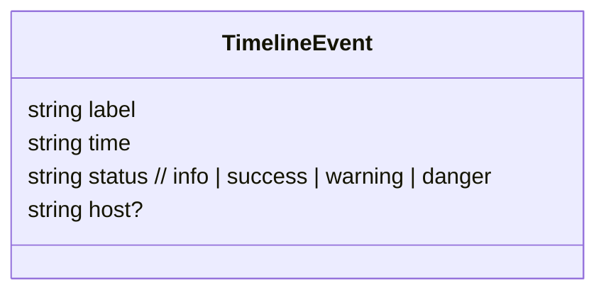

字段含义图：
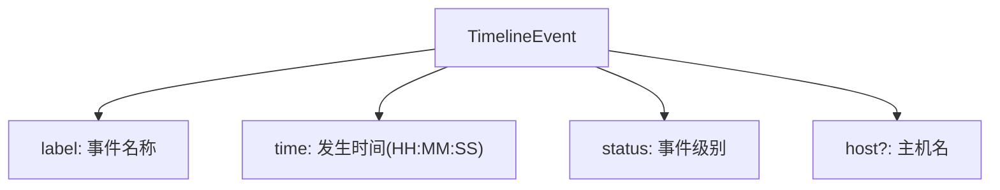

示例（时间线）：


来源：`TimelineEvents()` 由运行态事件队列生成。

---

## RoutePreview（路由提示）

```mermaid
classDiagram
class RoutePreview {
  string name
  string cond
  string action
}
```

字段含义图：
```mermaid
flowchart TB
  A["RoutePreview"] --> B["name: 规则名称"]
  A --> C["cond: 触发条件"]
  A --> D["action: 动作描述"]
```

示例（规则）：
```mermaid
flowchart LR
  A["When: path startsWith /data"] --> B["Action: 直传 go-watch-file"]
```

来源：`Routes(cfg)` 由配置构建的静态提示。

---

## MonitorNote（监控说明）

```mermaid
classDiagram
class MonitorNote {
  string title
  string detail
}
```

字段含义图：
```mermaid
flowchart TB
  A["MonitorNote"] --> B["title: 标题"]
  A --> C["detail: 说明"]
```

示例（说明）：
```mermaid
flowchart LR
  A["S3 连接"] --> B["endpoint=... · region=..."]
```

来源：`MonitorNotes(cfg)` 由配置构建的说明信息。

---

## ConfigSnapshot（配置表单快照）

```mermaid
classDiagram
class ConfigSnapshot {
  string watchDir
  string fileExt
  string silence
  string concurrency
  string action
}
```

字段含义图：
```mermaid
flowchart TB
  A["ConfigSnapshot"] --> B["watchDir: 监控目录"]
  A --> C["fileExt: 后缀过滤(可为空)"]
  A --> D["silence: 静默窗口"]
  A --> E["concurrency: 并发/队列展示字符串"]
  A --> F["action: 动作展示"]
```

来源：`ConfigSnapshot(cfg)`。

---

## HeroCopy（头部摘要）

```mermaid
classDiagram
class HeroCopy {
  string agent
  string[] watchDirs
  string suffixFilter
  string silence
  string queue
  string concurrency
}
```

字段含义图：
```mermaid
flowchart TB
  A["HeroCopy"] --> B["agent: 主机名"]
  A --> C["watchDirs: 监听目录列表"]
  A --> D["suffixFilter: 后缀过滤摘要"]
  A --> E["silence: 静默窗口"]
  A --> F["queue: 队列摘要字符串"]
  A --> G["concurrency: 并发摘要字符串"]
```

来源：`HeroCopy(cfg)`。

---

## ChartPoint（折线图点）

```mermaid
classDiagram
class ChartPoint {
  string label
  int uploads
  int failures
  int queue
}
```

字段含义图：
```mermaid
flowchart TB
  A["ChartPoint"] --> B["label: 时间点(HH:MM)"]
  A --> C["uploads: 成功累计"]
  A --> D["failures: 失败累计"]
  A --> E["queue: 队列长度"]
```

示例（折线点）：
```mermaid
flowchart LR
  A["12:30"] --> B["uploads=20"] --> C["failures=1"] --> D["queue=3"]
```

来源：`ChartPoints()`；若无数据会使用种子点填充。

---

## UploadRecord（上传记录）

```mermaid
classDiagram
class UploadRecord {
  string file
  string target
  string size
  string result  // success | failed | pending
  string latency
  string time
  string note?
}
```

字段含义图：
```mermaid
flowchart TB
  A["UploadRecord"] --> B["file: 文件名"]
  A --> C["target: 目标桶/路径"]
  A --> D["size: 文件大小"]
  A --> E["result: 上传结果"]
  A --> F["latency: 耗时(ms 或 --)"]
  A --> G["time: 发生时间(HH:MM:SS)"]
  A --> H["note?: 备注/原因"]
```

示例（记录）：
```mermaid
flowchart LR
  A["report.log"] --> B["success"] --> C["120 ms"] --> D["12:30:01"]
```

来源：`UploadRecords()` 由运行态上传历史生成（倒序）。

---

## MonitorSummary（摘要指标）

```mermaid
classDiagram
class MonitorSummary {
  string label
  string value
  string desc
}
```

字段含义图：
```mermaid
flowchart TB
  A["MonitorSummary"] --> B["label: 指标名"]
  A --> C["value: 指标值"]
  A --> D["desc: 说明/补充"]
```

示例（摘要卡）：
```mermaid
flowchart LR
  A["当前吞吐"] --> B["12/min"] --> C["队列中 + 已上传"]
```

来源：`MonitorSummary()`。

---

## 其它字段（非结构体类型）

### tailLines（日志尾部）
```mermaid
flowchart TB
  A["tailLines[]"] --> B["[12:30:01] 上传成功 /data/report.log"]
  A --> C["[12:30:05] 入队 /data/next.log"]
```

---

## 结构体 JSON 示例（字段更直观）

> 说明：以下为**示例数据**，用于帮助理解字段含义与层级结构。

### DashboardData（聚合返回体）
```json
{
  "heroCopy": {
    "agent": "srv-01",
    "watchDirs": ["C:/Users/admin/Downloads"],
    "suffixFilter": "关闭 · 全量目录",
    "silence": "10s",
    "queue": "队列 5",
    "concurrency": "上传并发 3"
  },
  "metricCards": [
    { "label": "今日上传", "value": "128", "trend": "今日成功", "tone": "up" },
    { "label": "失败率", "value": "2.1%", "trend": "今日统计", "tone": "warning" }
  ],
  "directoryTree": [
    {
      "name": "C:/Users/admin/Downloads",
      "path": "C:/Users/admin/Downloads",
      "type": "dir",
      "autoUpload": true,
      "children": [
        {
          "name": "report.log",
          "path": "C:/Users/admin/Downloads/report.log",
          "type": "file",
          "autoUpload": true,
          "size": "12 KB",
          "updated": "12:30:01",
          "content": "上传成功"
        }
      ]
    }
  ],
  "files": [
    {
      "name": "report.log",
      "path": "C:/Users/admin/Downloads/report.log",
      "size": "12 KB",
      "status": "uploaded",
      "time": "12:30:01",
      "autoUpload": true
    }
  ],
  "tailLines": ["[12:30:01] 上传成功 C:/Users/admin/Downloads/report.log"],
  "timelineEvents": [
    { "label": "上传成功", "time": "12:30:01", "status": "success", "host": "srv-01" }
  ],
  "routes": [
    { "name": "主目录上传", "cond": "path startsWith C:/Users/admin/Downloads", "action": "直传 go-watch-file" }
  ],
  "monitorNotes": [
    { "title": "S3 连接", "detail": "endpoint=oss-cn-hangzhou.aliyuncs.com · region=cn-hangzhou" }
  ],
  "uploadRecords": [
    {
      "file": "report.log",
      "target": "go-watch-file",
      "size": "12 KB",
      "result": "success",
      "latency": "120 ms",
      "time": "12:30:01",
      "note": "自动上传"
    }
  ],
  "monitorSummary": [
    { "label": "当前吞吐", "value": "12/min", "desc": "队列中 + 已上传" }
  ],
  "configSnapshot": {
    "watchDir": "C:/Users/admin/Downloads",
    "fileExt": "",
    "silence": "10s",
    "concurrency": "workers=3 / queue=100",
    "action": "上传 + Webhook"
  },
  "chartPoints": [
    { "label": "12:30", "uploads": 20, "failures": 1, "queue": 3 }
  ]
}
```

### FileNode
```json
{
  "name": "report.log",
  "path": "C:/Users/admin/Downloads/report.log",
  "type": "file",
  "autoUpload": true,
  "size": "12 KB",
  "updated": "12:30:01",
  "content": "上传成功"
}
```

### MetricCard
```json
{ "label": "今日上传", "value": "128", "trend": "今日成功", "tone": "up" }
```

### FileItem
```json
{
  "name": "report.log",
  "path": "C:/Users/admin/Downloads/report.log",
  "size": "12 KB",
  "status": "uploaded",
  "time": "12:30:01",
  "autoUpload": true,
  "requiresApproval": false
}
```

### TimelineEvent
```json
{ "label": "上传成功", "time": "12:30:01", "status": "success", "host": "srv-01" }
```

### RoutePreview
```json
{ "name": "主目录上传", "cond": "path startsWith C:/Users/admin/Downloads", "action": "直传 go-watch-file" }
```

### MonitorNote
```json
{ "title": "S3 连接", "detail": "endpoint=oss-cn-hangzhou.aliyuncs.com · region=cn-hangzhou" }
```

### ConfigSnapshot
```json
{
  "watchDir": "C:/Users/admin/Downloads",
  "fileExt": "",
  "silence": "10s",
  "concurrency": "workers=3 / queue=100",
  "action": "上传 + Webhook"
}
```

### HeroCopy
```json
{
  "agent": "srv-01",
  "watchDirs": ["C:/Users/admin/Downloads"],
  "suffixFilter": "关闭 · 全量目录",
  "silence": "10s",
  "queue": "队列 5",
  "concurrency": "上传并发 3"
}
```

### ChartPoint
```json
{ "label": "12:30", "uploads": 20, "failures": 1, "queue": 3 }
```

### UploadRecord
```json
{
  "file": "report.log",
  "target": "go-watch-file",
  "size": "12 KB",
  "result": "success",
  "latency": "120 ms",
  "time": "12:30:01",
  "note": "自动上传"
}
```

### MonitorSummary
```json
{ "label": "当前吞吐", "value": "12/min", "desc": "队列中 + 已上传" }
```
