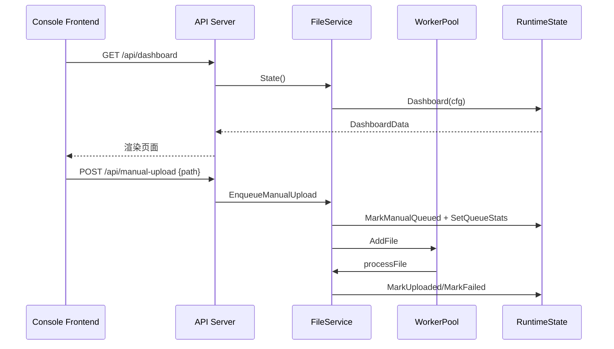

# 通用文件监控平台流程图

## 整体流程（当前实现）

```mermaid
graph TD
    A[业务系统写入文件] --> B[FileWatcher 递归监听]
    B --> C{后缀匹配?}
    C -->|否| B
    C -->|是| D[静默窗口判定写入完成]
    D --> E[入队 uploadQueue]
    E --> F[WorkerPool 并发上传]
    F --> G[S3 兼容对象存储]
    F --> H[RuntimeState 更新状态]
    H --> I[/api/dashboard]
    F --> J[通知: 钉钉/邮件(可选)]
```

## 控制台与 API 交互



## 说明
- 自动上传开关通过 `/api/auto-upload` 修改运行态，并影响目录/文件的自动上传策略。
- 文件 Tail 通过 `/api/file-log` 按需读取文件尾部内容，不走 Dashboard 数据。
- S3 与通知配置变更需重启服务，运行时配置仅包含目录/后缀/并发/静默窗口。
