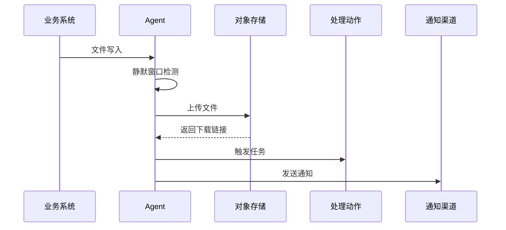

# 通用文件监控平台流程图

## 整体流程

```mermaid
graph TD
    A[文件源系统] --> B[本地落盘/共享盘]
    B --> C[go-watch-file Agent]
    C --> D{后缀匹配?}
    D -->|否| C
    D -->|是| E[写入完成判定]
    E --> F[上传至对象存储]
    F --> G[触发处理动作
(Jenkins/Webhook/脚本)]
    F --> H[通知推送
(企微/钉钉)]
    G --> I[处理结果/下游消费]
```

## 组件交互时序



## 关键校验与保护
- 只处理目标后缀文件，减少噪声事件。
- 通过相对路径校验与对象 Key 归一化，避免路径穿越。
- 上传失败会记录日志，后续可引入重试与补偿机制。
