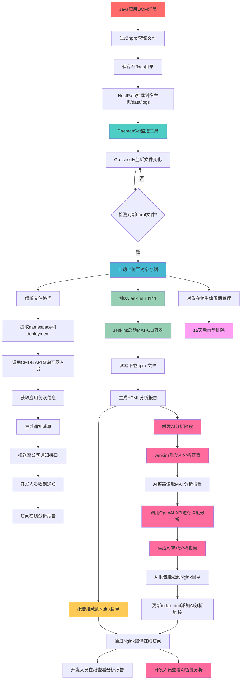
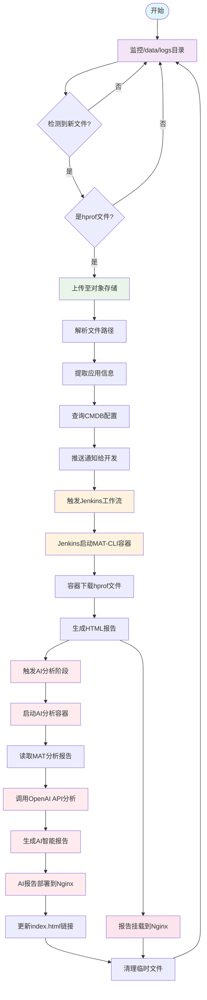
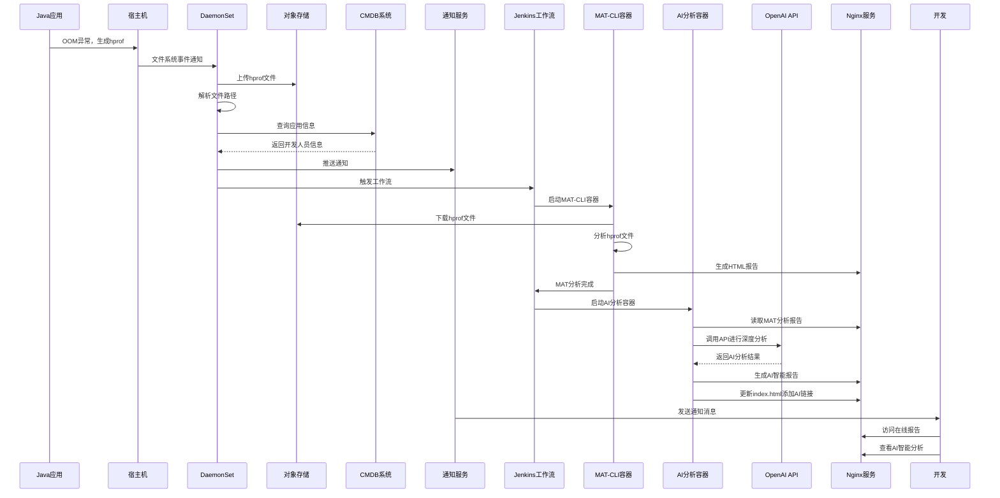
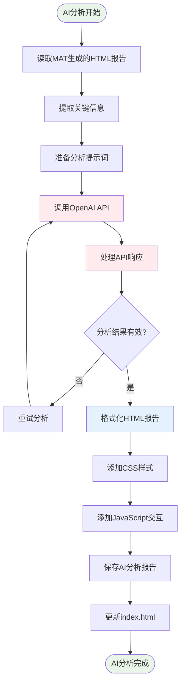
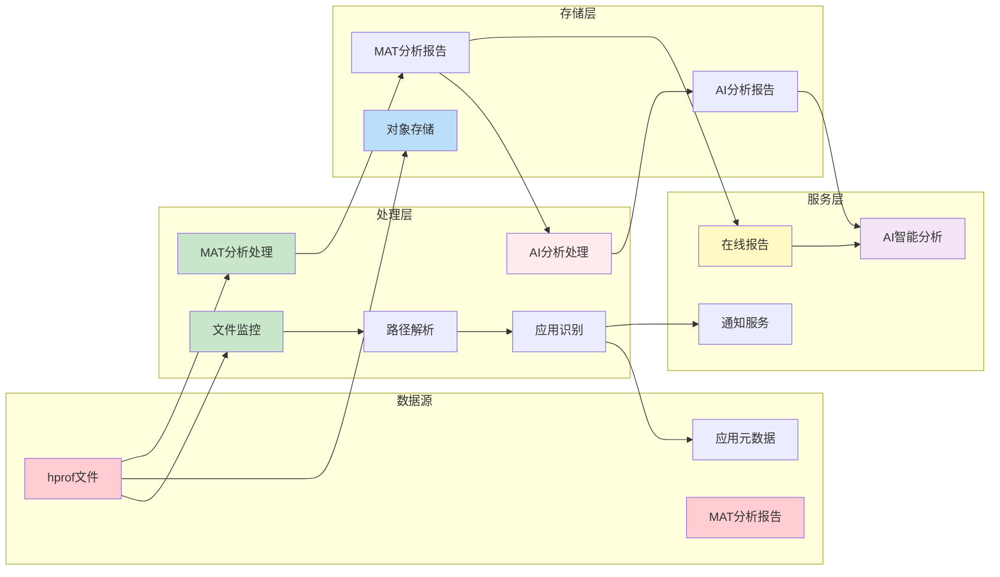
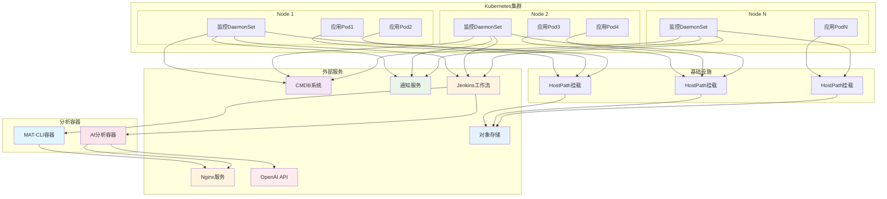
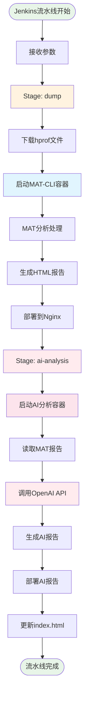
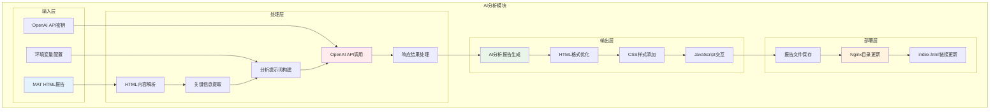
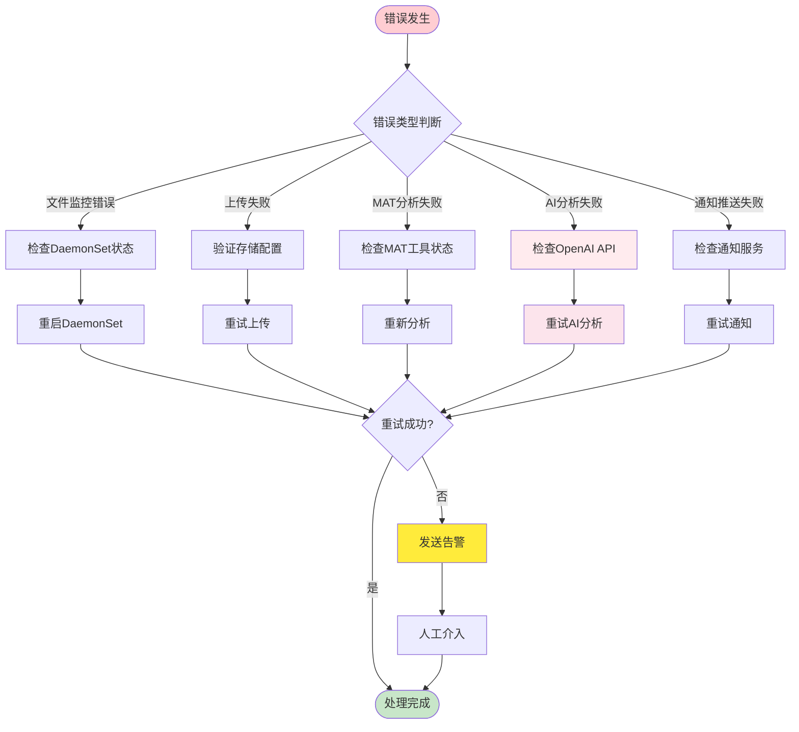

# Java堆内存转储自动化分析系统流程图

> 归档说明：本文件属于旧版 OOM 系统资料，与当前 go-watch-file 代码无直接关联，仅供参考。

## 系统整体流程图

## 详细工作流程图

## 组件交互时序图

## AI分析详细流程图

## 数据流向图

## 部署架构图

## Jenkins流水线流程图

## 监控指标图

```mermaid
graph TD
    subgraph "系统监控指标"
        M1[文件监控数量]
        M2[上传成功率]
        M3[处理延迟时间]
        M4[存储空间使用量]
    end
    
    subgraph "业务监控指标"
        B1[OOM发生频率]
        B2[文件大小分布]
        B3[开发响应时间]
        B4[在线报告访问量]
        B5[AI分析准确率]
    end
    
    subgraph "性能监控指标"
        P1[MAT分析耗时]
        P2[报告生成成功率]
        P3[通知推送延迟]
        P4[Jenkins工作流执行时间]
        P5[系统资源使用率]
        P6[AI分析耗时]
        P7[AI分析成功率]
        P8[OpenAI API调用延迟]
    end
    
    M1 --> Dashboard[监控仪表板]
    M2 --> Dashboard
    M3 --> Dashboard
    M4 --> Dashboard
    
    B1 --> Dashboard
    B2 --> Dashboard
    B3 --> Dashboard
    B4 --> Dashboard
    B5 --> Dashboard
    
    P1 --> Dashboard
    P2 --> Dashboard
    P3 --> Dashboard
    P4 --> Dashboard
    P5 --> Dashboard
    P6 --> Dashboard
    P7 --> Dashboard
    P8 --> Dashboard
    
    style Dashboard fill:#e8f5e8
    style M1 fill:#ffcdd2
    style B1 fill:#bbdefb
    style B5 fill:#ffebee
    style P1 fill:#fff9c4
    style P4 fill:#fff9c4
    style P6 fill:#fce4ec
    style P7 fill:#fce4ec
    style P8 fill:#fce4ec
```

## AI分析技术架构图

## 错误处理流程图

